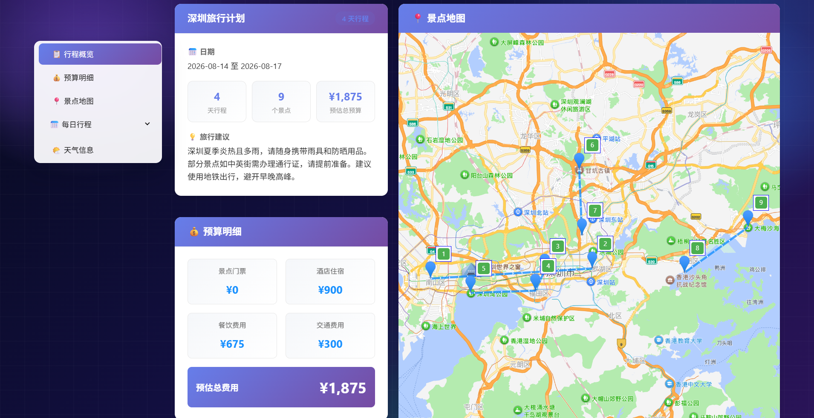

# LangChain 智能旅行助手 🌍✈️

基于 **LangChain + LangGraph + FastAPI** 构建的智能旅行规划助手，直调高德地图 Web 服务 API，提供个性化的多日旅行计划生成，并内置 **RAG 知识库检索**与**行程历史记录持久化**。


## ✨ 功能特点

- 🤖 **LangGraph 工作流编排**: 用 StateGraph 构建多节点旅行规划流水线（搜景点 → 查天气 → 搜酒店 → 生成行程 → 兜底），支持条件路由
- 🧠 **RAG 知识库检索增强**: 内置 4 城市旅游知识库（深圳/北京/上海/广州，含门票/交通/避坑/美食/住宿），千问 `text-embedding-v4` 向量化存入 ChromaDB，规划时自动检索并注入 LLM
- 🏆 **知识库景点落地**: 知识库知名景点按名搜索补真实坐标进入行程候选；生成后每个景点自动回填门票/开放时间/交通/避坑详情
- 📜 **行程历史记录**: SQLite 持久化每次生成的行程，支持分页查询、按城市筛选、查看、编辑、删除；**编辑修改可写回数据库**
- 🗺️ **高德地图直调**: httpx 直接调用高德 Web 服务 REST API，无外部 MCP 进程依赖
- 📸 **国内图源**: 景点图片优先取高德 POI 实景图（国内 CDN，快且稳），带 QPS 节流与熔断保护
- 🛡️ **优雅降级**: 数据节点失败返回空列表、LLM 失败走备用计划、RAG 未配置 Key 自动禁用，保证接口始终可用
- 🧱 **企业级工程化**: 日志落盘与轮转、全局异常处理、Prometheus 监控、Docker 一键部署、pytest 自动化测试
- 🔌 **兼容任意模型**: 换 LLM 只需改 `.env` 三个参数（Key / Base URL / Model），无需改代码
- 🎨 **现代化前端**: Vue3 + TypeScript + Vite + Ant Design Vue，深空霓虹渐变主题 + 玻璃拟态卡片

## 📸 界面预览





## 🏗️ 技术栈

### 后端
- **智能体框架**: LangChain + LangGraph（StateGraph 编排）
- **LLM**: langchain-openai `ChatOpenAI`（兼容 OpenAI / DeepSeek 等任意 OpenAI 协议端点）
- **RAG 向量库**: ChromaDB（`langchain-chroma`，持久化到 `backend/data/chroma`）
- **Embedding**: 千问 `text-embedding-v4`（阿里云百炼 DashScope，直接封装官方 SDK，不依赖 langchain-dashscope 薄封装）
- **数据库**: SQLAlchemy 2.0 + SQLite（`trip_planner.db`，可无缝切换 PostgreSQL）
- **API**: FastAPI + Pydantic v2
- **第三方服务**: 高德 Web 服务 API（httpx 直调 REST）

### 前端
- **框架**: Vue 3 + TypeScript
- **构建工具**: Vite
- **UI组件库**: Ant Design Vue
- **地图服务**: 高德地图 JavaScript API
- **HTTP客户端**: Axios

## 🏛️ 架构分层

```
┌──────────────────────────────────────────────────┐
│  FastAPI 路由层  app/api/routes/                  │
│  trip.py / map.py / poi.py / history.py / rag.py │
└──────────┬──────────────────────────┬────────────┘
           │                          │
┌──────────▼──────────────┐  ┌───────▼─────────────┐
│  Agent 编排层           │  │  RAG / 历史服务层    │
│  app/agents/            │  │  app/services/       │
│  LangGraph StateGraph:  │  │  rag_service.py      │
│  search_attractions →   │  │   (ChromaDB + 嵌入)  │
│  get_weather →          │  │  history_service.py  │
│  search_hotels →        │  │   (SQLite CRUD)      │
│  generate_trip_plan     │  └──────────┬──────────┘
│  →(失败)→ fallback_plan │             │
└──────────┬──────────────┘  ┌──────────▼─────────┐
           └────────────────►│  数据库层 app/db/   │
                             │  database.py       │
                             │  models.py         │
                             └────────────────────┘
           ┌──────────────────────────────────────┐
           │  服务层  app/services/                │
           │  amap_service.py (高德REST)           │
           │  llm_service.py  (ChatOpenAI工厂)     │
           └──────────────────────────────────────┘
```

## 📁 项目结构

```
langgraph-trip/
├── backend/                        # 后端服务
│   ├── app/
│   │   ├── agents/                # LangGraph 智能体编排
│   │   │   └── trip_planner_agent.py
│   │   ├── api/                   # FastAPI 路由
│   │   │   ├── main.py            # 应用入口(lifespan 初始化 DB/RAG)
│   │   │   └── routes/
│   │   │       ├── trip.py        # 旅行规划(生成后自动存历史+RAG入库)
│   │   │       ├── map.py         # 地图/天气/路线
│   │   │       ├── poi.py         # 景点图片
│   │   │       ├── history.py     # 历史记录 CRUD
│   │   │       └── rag.py         # RAG 状态/重建
│   │   ├── services/              # 服务层
│   │   │   ├── amap_service.py    # 高德 REST API 客户端
│   │   │   ├── llm_service.py     # ChatOpenAI 工厂
│   │   │   ├── rag_service.py     # RAG: 知识索引+检索+上下文注入
│   │   │   └── history_service.py # 历史记录: SQLite CRUD
│   │   ├── db/                    # 数据库层
│   │   │   ├── database.py        # SQLAlchemy 引擎/会话/建表
│   │   │   └── models.py          # TripRecord 模型
│   │   ├── core/                  # 通用基础设施
│   │   │   ├── logging.py         # 日志配置(控制台+文件落盘+轮转)
│   │   │   └── exceptions.py      # 业务异常与全局异常处理器
│   │   ├── models/                # Pydantic 数据模型
│   │   │   └── schemas.py
│   │   └── config.py              # 配置管理 (pydantic-settings)
│   ├── data/                      # 运行时数据
│   │   ├── knowledge/             # RAG 知识库文档(4城市, 需入库保留)
│   │   │   ├── shenzhen.md
│   │   │   ├── beijing.md
│   │   │   ├── shanghai.md
│   │   │   └── guangzhou.md
│   │   ├── chroma/                # ChromaDB 向量库(运行时生成, 已 gitignore)
│   │   └── trip_planner.db        # SQLite 历史数据库(运行时生成, 已 gitignore)
│   ├── tests/                     # pytest 自动化测试(隔离真实网络)
│   │   ├── conftest.py
│   │   ├── test_health.py
│   │   ├── test_trip_route.py
│   │   ├── test_exceptions.py
│   │   └── test_amap_service.py
│   ├── logs/                      # 运行日志(自动生成, 已 gitignore)
│   ├── run.py                     # 启动脚本
│   ├── Dockerfile
│   ├── docker-compose.yml
│   ├── requirements.txt
│   └── .env                       # 环境变量(已 gitignore)
├── frontend/                       # 前端应用
│   ├── src/
│   │   ├── services/              # API 服务
│   │   ├── types/                 # TypeScript 类型
│   │   └── views/                 # Home.vue / Result.vue / History.vue
│   ├── package.json
│   └── vite.config.ts
└── README.md
```

## 🚀 快速开始

### 前提条件

- Python 3.10+
- Node.js 16+
- 高德地图 API Key（Web 服务 API：`AMAP_API_KEY`；前端 JS API：`VITE_AMAP_WEB_JS_KEY`）
- LLM API Key（OpenAI / DeepSeek 等，需支持 OpenAI 兼容协议）
- （可选）阿里云百炼 DashScope API Key，用于启用 RAG 知识库检索

### 后端安装

1. 进入后端目录并创建虚拟环境
```bash
cd backend
python -m venv venv
venv\Scripts\activate  # Windows
```

2. 安装依赖
```bash
pip install -r requirements.txt
```

3. 配置环境变量（编辑 `backend/.env`）
```bash
# 高德地图
AMAP_API_KEY=你的高德Web服务Key

# LLM (以DeepSeek为例; 换其他模型只需改这三项)
LLM_API_KEY=你的LLM Key
LLM_BASE_URL=https://api.deepseek.com/v1
LLM_MODEL_ID=deepseek-chat

# RAG 知识库 (可选, 留空则 RAG 自动禁用, 不影响主流程)
DASHSCOPE_API_KEY=你的阿里云百炼Key   # 控制台: bailian.console.aliyun.com
EMBEDDING_MODEL=text-embedding-v4     # 嵌入模型名(默认即可)

# 可选: 模型参数与日志级别
LLM_TEMPERATURE=0.7
LLM_TIMEOUT=60
LOG_LEVEL=INFO
```

4. 启动后端
```bash
python run.py
# 或: uvicorn app.api.main:app --reload --host 0.0.0.0 --port 8000
```

启动时看到 `🧠 RAG 知识库已就绪` 表示 RAG 已启用；若未配置 DashScope Key，会打印降级提示但服务照常运行。

### 前端安装

1. 进入前端目录
```bash
cd frontend
```

2. 安装依赖并配置环境变量
```bash
npm install
# 编辑 .env: 填入高德 Web服务Key 和 Web端(JS API) Key
```

3. 启动开发服务器
```bash
npm run dev
```

4. 浏览器访问 `http://localhost:5173`

### Docker 部署（可选）

```bash
cd backend
docker compose up -d --build   # 构建镜像并启动容器
docker compose down            # 停止并移除容器
```

- 容器包含 healthcheck 健康探针，`docker ps` 显示 `healthy` 即部署成功
- `./data` 目录已挂载为数据卷，SQLite 数据库与 Chroma 向量库**重启容器不丢失**
- 验证: `http://localhost:8000/health`（服务状态）、`http://localhost:8000/metrics`（Prometheus 指标）
- **注意**: 容器占用 8000 端口。若之后想用本地 `python run.py` 调试，先 `docker compose down`，否则浏览器访问 `localhost` 会被容器接管、本地后端收不到请求

### 运行自动化测试

```bash
cd backend
pytest -v
```

测试使用 mock 环境变量隔离真实网络，**不会发出任何真实的高德/LLM 请求**，可放心本地运行。

## 📝 使用指南

1. 在首页填写旅行信息：目的地城市、旅行日期/天数、交通与住宿偏好、旅行风格
2. 点击"生成旅行计划"
3. 后端 LangGraph 工作流按序执行：
   - 搜景点（高德 POI 搜索 + **RAG 知识库景点补充**）
   - 查天气（高德天气，覆盖行程首日 +3 天）
   - 搜酒店（高德 POI 搜索）
   - **RAG 检索**: 从知识库/历史行程中检索该城市相关知识，注入 LLM Prompt
   - LLM 生成结构化行程（含每日三餐、交通、住宿、景点时间与预算）
   - **知识库回填**: 每个景点自动追加门票/开放时间/交通/避坑详情
   - 任一步失败自动降级，LLM 失败走备用计划
4. 结果页展示：每日详细行程、景点地图标记与实景图、天气预报、酒店推荐、知识库详情
5. **历史行程**: 首页右上角「📜 历史行程」进入历史页，可查看/编辑/删除历史计划；编辑保存后修改会写回数据库

## 🔧 核心实现

### LangGraph 工作流

```python
from langgraph.graph import StateGraph, START, END

class GraphState(TypedDict):
    request: TripPlanRequest
    attraction_pois: List[POIInfo]
    weather_info: List[WeatherInfo]
    hotel_pois: List[POIInfo]
    trip_plan: Optional[TripPlan]
    error: Optional[str]

builder = StateGraph(GraphState)
builder.add_node("search_attractions", search_attractions_node)
builder.add_node("get_weather", get_weather_node)
builder.add_node("search_hotels", search_hotels_node)
builder.add_node("generate_trip_plan", generate_trip_plan_node)
builder.add_node("fallback_plan", fallback_plan_node)

builder.add_edge(START, "search_attractions")
builder.add_edge("search_attractions", "get_weather")
builder.add_edge("get_weather", "search_hotels")
builder.add_edge("search_hotels", "generate_trip_plan")
# 条件路由: LLM 失败时走备用计划, 否则到 END
builder.add_conditional_edges("generate_trip_plan", route_after_generation)
builder.add_edge("fallback_plan", END)
```

### RAG 知识库

- **知识文档**: `backend/data/knowledge/*.md`（深圳/北京/上海/广州，含景点门票、开放时间、地铁交通、打卡点、避坑指南、美食住宿、经典路线）
- **向量化**: 千问 `text-embedding-v4`，`RecursiveCharacterTextSplitter` 切块（300 字符/50 重叠）
- **存储**: ChromaDB 双 collection——`trip_knowledge`（知识库）+ `trip_history`（增量保存生成的行程）
- **注入**: 规划前检索该城市 top-k 片段，以"检索到的相关知识"段落注入 Prompt；知识库景点按名补坐标进候选；生成后逐景点回填详情
- **降级**: 未配置 `DASHSCOPE_API_KEY` 时自动禁用，所有相关代码 try/except 静默跳过，不影响主流程
- **重建索引**: `POST /api/rag/rebuild`（修改知识文档后调用）；状态查看 `GET /api/rag/status`

```python
# Embedding 直接封装 DashScope 官方 SDK (无需 langchain-dashscope)
import dashscope
from langchain_core.embeddings import Embeddings

class _DashScopeEmbeddings(Embeddings):
    def embed_documents(self, texts):
        rsp = dashscope.TextEmbedding.call(
            model="text-embedding-v4", input=texts, ...)
        return [item["embedding"] for item in rsp.output["embeddings"]]
```

### 历史记录持久化

- 行程生成成功后自动保存到 SQLite（`TripRecord` 模型）
- 前端历史页支持分页 / 按城市筛选 / 查看 / 删除
- 结果页编辑行程后点击保存，通过 `PUT /api/history/{id}` 将编辑结果**写回数据库**

### LLM 结构化输出

```python
from langchain_core.prompts import ChatPromptTemplate

prompt = ChatPromptTemplate.from_messages([
    ("system", SYSTEM_PROMPT),
    ("user", USER_PROMPT),
])
result = llm.invoke(prompt.format_messages(...))
data = extract_json_from_text(result.content)   # 提取 JSON
trip_plan = TripPlan.model_validate(data)       # Pydantic 校验
```

### 高德 REST 直调（无 MCP 依赖）

- 景点搜索: `GET https://restapi.amap.com/v3/place/text`
- 天气: 先地理编码拿 adcode → `GET /v3/weather/weatherInfo`
- 路线: 地理编码 → `GET /v3/direction/{walking|driving|transit}`
- 图片: `GET /v3/place/detail` 返回 POI 实景图（国内 CDN），带 QPS 节流 + CUQPS 熔断

## 📊 日志与监控

### 日志体系（`backend/logs/`）

| 文件 | 级别 | 用途 |
|---|---|---|
| `app.log` | INFO+ | 全量运行日志（请求耗时、高德调用、Agent 步骤、RAG 检索、异常堆栈） |
| `error.log` | ERROR+ | 只记错误，平时基本为空；变大说明有问题需要排查 |

- 单文件最大 5MB，超限自动滚动为 `app.log.1` 等备份（共保留 5 份）
- 文件已加入 `.gitignore`，日志不提交到 git
- 判断技巧: 日志里的 `testserver`、`模拟未捕获异常` 都是 pytest 测试产物，可忽略

### Prometheus 监控

- 端点: `GET /metrics`（本地 Docker 部署时验证: `http://localhost:8000/metrics`）
- 输出标准 Prometheus 格式指标（HTTP 请求数、耗时分布、延迟直方图等），可接入 Grafana 可视化

## 📚 API 文档

启动后端后访问 `http://localhost:8000/docs` 查看 Swagger 文档。

主要端点：

| 端点 | 说明 |
|---|---|
| `POST /api/trip/plan` | 生成旅行计划（核心，成功后自动存历史 + RAG 入库） |
| `GET /api/trip/health` | Agent 健康检查 |
| `GET /api/history` | 历史记录列表（分页、按城市筛选） |
| `GET /api/history/{id}` | 历史记录详情（含完整行程） |
| `PUT /api/history/{id}` | 更新历史记录（前端编辑保存） |
| `DELETE /api/history/{id}` | 删除历史记录 |
| `GET /api/rag/status` | RAG 状态（是否启用、索引数量） |
| `POST /api/rag/rebuild` | 重建知识索引（修改知识文档后调用） |
| `GET /api/map/poi` | 搜索 POI |
| `GET /api/map/weather` | 查询天气 |
| `POST /api/map/route` | 规划路线 |
| `GET /api/poi/photo?name=xxx` | 获取景点图片 |
| `GET /health` | 服务健康检查 |
| `GET /docs` | Swagger 文档 |

## ❓ 常见问题

**Q1: 前端执行计划后，控制台/日志看不到 Agent 步骤日志（"步骤1: 搜索景点..."等）？**

大概率是请求没打到本地后端。检查：
1. `docker ps` 看是否有容器占用 8000 端口（浏览器访问 `localhost` 优先走 IPv6 被容器接管）→ `docker compose down` 停掉
2. 确认本地后端正常启动（终端看到 `Application startup complete.`），再用浏览器访问 `http://127.0.0.1:8000/health` 验证

**Q2: 换 LLM 模型怎么改？**

编辑 `backend/.env` 三个参数即可，无需改代码：
```bash
LLM_API_KEY=新模型Key
LLM_BASE_URL=https://api.xxx.com/v1
LLM_MODEL_ID=新模型名
```

**Q3: RAG 没生效？启动没看到"RAG 知识库已就绪"？**

1. 确认 `backend/.env` 已配置 `DASHSCOPE_API_KEY`（阿里云百炼免费开通：bailian.console.aliyun.com）
2. 确认已重启后端（配置在启动时读取）
3. 修改过 `data/knowledge/*.md` 后调用 `POST /api/rag/rebuild` 重建索引
4. 未配置 Key 时 RAG 自动禁用，行程规划功能不受影响（这是设计上的优雅降级）

**Q4: 修改知识库文档后，检索结果没更新？**

向量索引不会自动重建。修改文档后调用一次 `POST /api/rag/rebuild` 即可。

**Q5: 编辑行程保存后，重新打开历史为什么没变？**

编辑保存依赖 `PUT /api/history/{id}` 写回数据库（已实现）。若提示"保存失败, 修改仅保留在本地"，检查后端是否在运行、`/api/history` 接口是否可用。

**Q6: `app.log` 里一堆 `watchfiles: 1 change detected`？**

这是热重载循环的历史噪音，已通过 `reload_dirs=["app"]` 限制监视范围解决；旧记录清空 `logs/app.log` 即可。

**Q7: 日志里出现 `模拟未捕获异常`、`testserver`？**

是 pytest 测试故意触发的异常堆栈，不是真实 bug，忽略即可。

## 🤝 贡献指南

欢迎提交 Pull Request 或 Issue！


## 🙏 文档和资源

- [LangChain](https://github.com/langchain-ai/langchain) - 大模型应用框架
- [LangGraph](https://github.com/langchain-ai/langgraph) - Agent 编排框架
- [FastAPI](https://github.com/fastapi/fastapi) - 高性能 Web 框架
- [高德开放平台](https://lbs.amap.com/) - 地图服务
- [阿里云百炼 DashScope](https://bailian.console.aliyun.com) - 千问 embedding 模型
- [ChromaDB](https://github.com/chroma-core/chroma) - 向量数据库
- [HelloAgents](https://github.com/datawhalechina/hello-agents) - 原版项目（本项目的重构起点）
